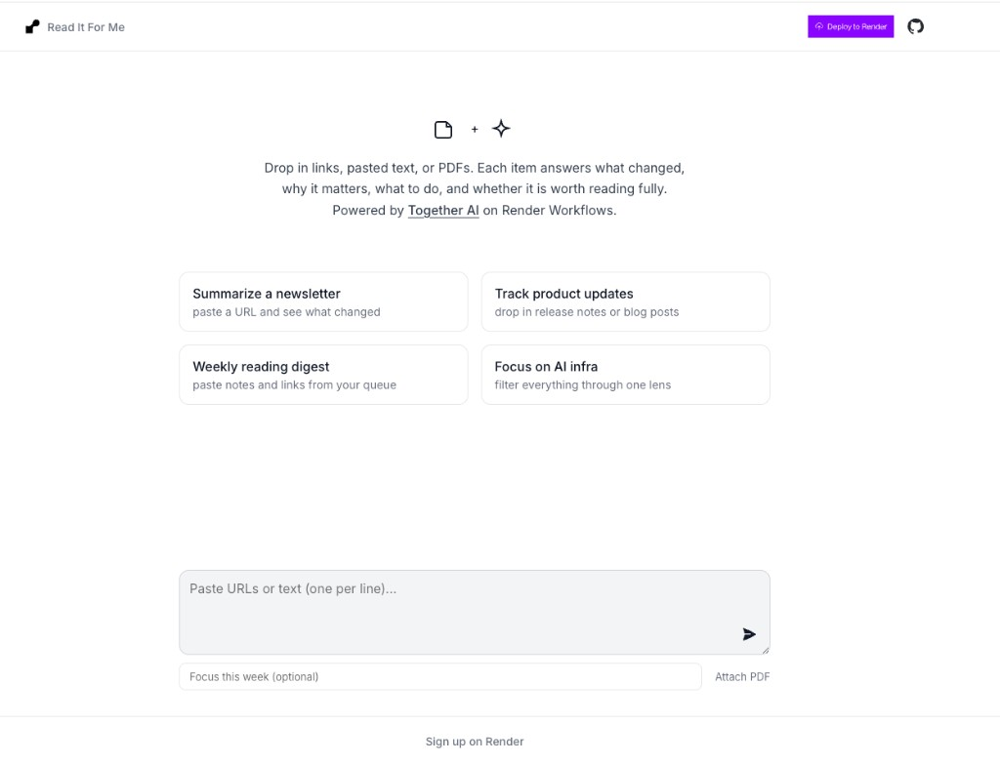
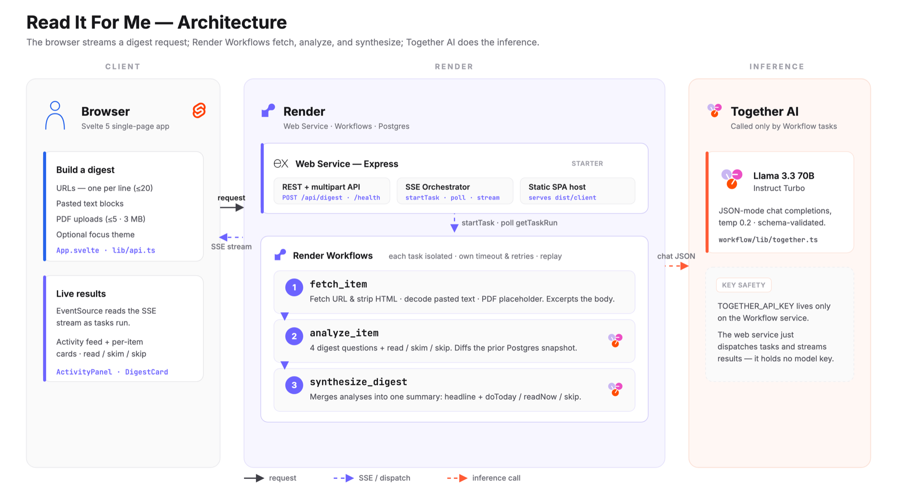
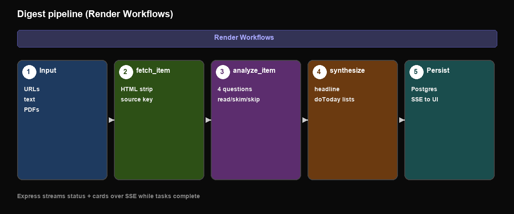

# Read It For Me

[](https://read-it-for-me.onrender.com/)

Personal daily digest for links, pasted text, and PDFs. Each item answers what changed, why it matters, what to do, and whether it is worth reading fully.

[Live demo](https://read-it-for-me.onrender.com/) · [Deploy on Render](https://render.com/deploy)

Built with [ Svelte 5](https://svelte.dev/), [ Express](https://expressjs.com/), [ Render Workflows](https://render.com/docs/workflows), and [ Render Postgres](https://render.com/docs/postgresql).

Inference by [ Together AI](https://www.together.ai/).

## Table of contents

- [Highlights](#highlights)
- [Overview](#overview)
- [Architecture](#architecture)
- [Usage](#usage)
- [Deploy on Render](#deploy-on-render)
- [Configuration](#configuration)
- [Operations](#operations)
- [Project structure](#project-structure)
- [Troubleshooting](#troubleshooting)
- [License](#license)

## Highlights

- **Action-oriented cards**, not generic summaries: every item gets `whatChanged`, `whyCare`, `whatToDo`, and a `read` / `skim` / `skip` verdict.
- **Live progress** over Server-Sent Events while workflow tasks run on Render.
- **Change tracking** via Postgres snapshots: repeat sources compare against the last digest.
- **Separated layers**: Svelte UI, Express API, and workflow tasks live in distinct folders with shared types in `shared/`.
- **Together AI stays in workflows**: the web service orchestrates tasks; it never calls the LLM directly.

## Overview

Read It For Me is for people who skim newsletters, release notes, and long threads and want a structured digest instead of a paragraph of fluff.

You submit URLs (one per line), pasted text blocks, optional PDFs, and an optional focus string (for example "AI infra" or "hiring"). The Express server starts Render Workflow tasks, polls until each completes, and streams status updates and per-item cards back to the browser. When all items are analyzed, a synthesis task produces a headline plus `doToday`, `readNow`, and `skip` lists.

The workflow service uses Together AI (default: `meta-llama/Llama-3.3-70B-Instruct-Turbo`) inside `analyze_item` and `synthesize_digest`. Prior snapshots from Postgres feed into the analyze prompt so the model can comment on what changed since the last run.

**Current MVP gaps:** PDF uploads are accepted but text extraction is a placeholder. The workflow service is created manually in the Render Dashboard (not in `render.yaml`), matching the pattern used in other Render Workflows examples in this workspace.

## Architecture





| Layer | Folder | Role |
|-------|--------|------|
| UI | `frontend/` | Svelte 5 form, SSE client, digest cards |
| API | `server/` | Express routes, orchestrator, Postgres, static SPA |
| Tasks | `workflow/` | `fetch_item`, `analyze_item`, `synthesize_digest` |
| Contracts | `shared/` | Types and Render URL helpers |

## Usage

### Web UI

1. Open the deployed app.
2. Paste URLs, text, optional PDFs, and an optional focus.
3. Click **Build digest**. Cards appear as each item finishes; the summary panel loads at the end.

### API (SSE)

`POST /api/digest` accepts `multipart/form-data`:

| Field | Type | Notes |
|-------|------|-------|
| `urls` | string | Newline-separated URLs (max 20 lines) |
| `text` | string | Newline-separated text blocks |
| `focus` | string | Optional theme, max 500 chars |
| `pdfs` | file[] | Optional PDFs, max 5 files, 3 MB each |

Response is `text/event-stream` with events: `status`, `card`, `done`, `error`.

Requires `RENDER_API_KEY` and `DATABASE_URL` on the web service. Returns `503` if either is missing.

### Health

```bash
curl https://your-service.onrender.com/health
# {"ok":true}
```

## Deploy on Render

Primary path: Blueprint for the web service and database, then a manual Workflow service.

### 1. Push to GitHub

Connect this repository to GitHub if it is not already.

### 2. Deploy the Blueprint

Use the **Deploy to Render** button in the app UI, or apply [`render.yaml`](render.yaml) from the Render Dashboard. This creates:

- **Web service** `read-it-for-me` — `node dist/server/index.js`, health check `/health`
- **Postgres** `read-it-for-me-db` — connection string wired to `DATABASE_URL`

Set `RENDER_API_KEY` on the web service (Account Settings → API Keys).

### 3. Create the Workflow service

The Blueprint does not include the workflow runner. In the Dashboard:

1. **New → Workflow** (link the same repo).
2. **Build command:** `npm install && npm run build`
3. **Start command:** `node dist/workflow/index.js`
4. **Environment:**
   - `TOGETHER_API_KEY` — required
   - `DATABASE_URL` — same Postgres as the web service (internal URL on the private network)
   - `TOGETHER_MODEL` — optional, defaults to Llama 3.3 70B Instruct Turbo
5. Note the workflow **slug** (default expectation: `read-it-for-me-workflow`). Set `WORKFLOW_SLUG` on the web service if yours differs.

### 4. Verify

- `GET /health` returns `{"ok":true}`
- Submit a digest from the UI with at least one URL
- Check workflow task logs in the Render Dashboard if cards never appear

## Configuration

### Web service (`read-it-for-me`)

| Variable | Required | Default | If missing |
|----------|----------|---------|------------|
| `RENDER_API_KEY` | Yes (for digest) | — | `/api/digest` returns 503; `/health` still works |
| `DATABASE_URL` | Yes (for digest) | — | `/api/digest` returns 503; persistence disabled |
| `WORKFLOW_SLUG` | No | `read-it-for-me-workflow` | Task paths won't match your workflow |
| `GITHUB_REPO_URL` | No | `https://github.com/ojusave/read-it-for-me` | Deploy button points at default repo |
| `POLL_INTERVAL_MS` | No | `3000` | Task poll interval |
| `PORT` | No | `3000` | Set by Render in production |
| `NODE_ENV` | No | — | `production` enables Postgres SSL |

### Workflow service

| Variable | Required | Default | If missing |
|----------|----------|---------|------------|
| `TOGETHER_API_KEY` | Yes | — | `analyze_item` / `synthesize_digest` fail |
| `DATABASE_URL` | Recommended | — | Snapshots not written from workflow side (web service handles persistence) |
| `TOGETHER_MODEL` | No | `meta-llama/Llama-3.3-70B-Instruct-Turbo` | Falls back to default model |

## Operations

- **Health check:** `GET /health` — used by Render on the web service.
- **Logs:** Render Dashboard → service → Logs. Workflow task output appears on the Workflow service.
- **Database:** Tables `digest_runs`, `source_snapshots`, `digest_items` are created on web service startup when `DATABASE_URL` is set.
- **Ephemeral disk:** Uploaded PDFs are read in memory and deleted; do not rely on local filesystem persistence on Render.
- **Free tier:** Web services spin down after inactivity; first request after idle may be slow. Free Postgres expires after 30 days.

## Project structure

```
read-it-for-me/
├── frontend/src/          # Svelte UI (components, api client)
├── server/
│   ├── index.ts           # Express entry, static files, config route
│   ├── routes/            # health, digest
│   └── lib/               # db, orchestrator, sse
├── workflow/
│   ├── index.ts           # Task registration
│   ├── tasks/             # fetch, analyze, synthesize
│   └── lib/together.ts   # Together AI adapter
├── shared/                # types.ts, renderUrls.ts
├── static/images/         # README architecture diagrams
├── render.yaml            # Web + Postgres Blueprint
└── vite.config.ts         # Builds frontend → dist/client
```

**Where to change things**

- Digest prompts and LLM JSON shape: `workflow/tasks/analyze.ts`, `workflow/tasks/synthesize.ts`
- SSE event shape: `server/lib/orchestrator.ts`, `shared/types.ts`
- UI layout and streaming client: `frontend/src/App.svelte`, `frontend/src/lib/api.ts`
- Postgres schema: `server/lib/db.ts`

## Troubleshooting

**`RENDER_API_KEY is not configured`**

Set the key on the web service. The server starts without it, but digest requests are blocked.

**`DATABASE_URL is not configured`**

Wire Postgres from the Blueprint on the web service. Digest requires persistence for snapshot diffs.

**Tasks fail immediately / wrong workflow**

Confirm `WORKFLOW_SLUG` on the web service matches the slug shown on your Workflow service in the Dashboard. Task names are `{slug}/fetch_item`, `{slug}/analyze_item`, `{slug}/synthesize_digest`.

**Together errors**

Check `TOGETHER_API_KEY` on the Workflow service and that the model name in `TOGETHER_MODEL` is available on your Together account.

**PDF content is generic**

Expected in MVP: `fetch_item` returns placeholder text for PDFs until real extraction is added.

**Stale UI after deploy**

Run `npm run build` before deploy. The web service serves `dist/client`; Vite dev server is not used in production.

## License

This project is licensed under the [MIT License](LICENSE).
